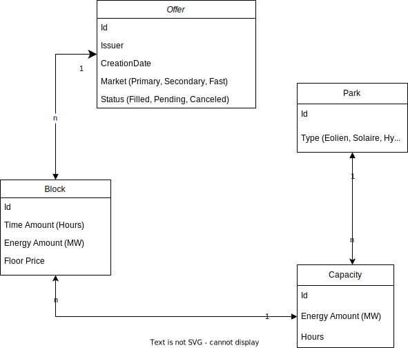

# agregio.technical-interview Project

## About the project :

This project uses Quarkus v2.16.4

## Launch

### Project
```
./gradlew quarkusDev
```
The http port is the default port 8080

### Tests
```
./gradlew clean build
```


## Interact with the api

[Swagger Link](http://localhost:8080/q/swagger-ui/#/)


## Payload

### Create a park
```
{
  "name": "MyWIndFactory",
  "type": "WIND",
  "capacityList": [
    {
      "energyAmount": 30,
      "hours": 2
    }
  ]
}
```

### Create an offer (matching the park above)
```
{
  "issuer": "string",
  "market": "PRIMARY",
  "blockList": [
    {
      "timeAmount": 1,
      "energyAmount": 30
    }
  ]
}
```

### Schema



